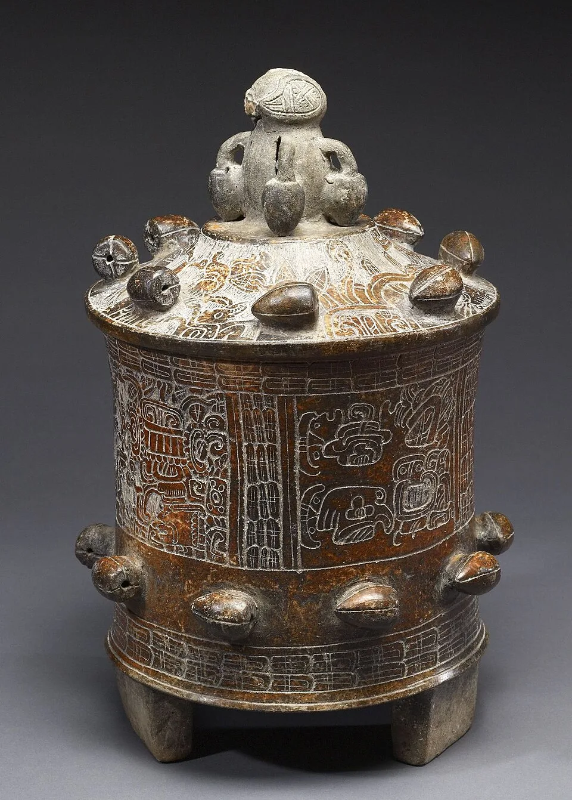

footer: Brazilian Bean to Bar
slidenumbers: true
autoflow: true

#[fit] Brazilian
#[fit] Bean to Bar
#[fit] **Chocolate**

---

Grab the chocolate bar
nearest to you.

Read the **label**.

^Really — a KitKat, whatever's in the drawer. This talk starts there.

---

Sugar. Vegetable fat.
Cocoa powder. Vanilla.
Lecithin. **Flavoring.**

^A typical supermarket bar. 5-10% actual cacao. Sugar always comes first.

---

Chocolate that tastes of everything
**except cacao.**

^How did we get here? To answer that, rewind three thousand years.

---

#[fit] Rewind
#[fit] **3,000 years.**

---

The Maya drank their cacao —
bitter, spiced, **alive with flavor**.

This vessel held chocolate a thousand
years before the candy bar.

^A real Maya chocolate-drinking vessel (Walters Art Museum, public domain). Cacao was ground, mixed with water and chili, poured from height for foam.

---

For the Maya and the Aztec,
cacao was **currency**.

A turkey: 100 beans.
An avocado: 3.

^You could literally spend chocolate. Counterfeiters made fake beans out of clay.

---

Then the 20th century happened.

**Cheap. Sweet. Identical.**

Millions of bars, one flavor.

^Industrial chocolate is an engineering marvel — and a flavor funeral. Heavy roasting hides bean defects; additives standardize everything.

---

We traded **flavor**
for uniformity.

---

#[fit] Then someone
#[fit] started over.
#[fit] From the **bean**.

---

**Cocoa nibs**: roasted cacao beans,
cracked and winnowed.

Two ingredients: cacao and sugar.

^The maker controls every step from here: grinding, conching for hours, tempering, molding.

---

# The Process

:::diagram
graph LR
  A[Harvest & Ferment] --> B[Dry & Roast]
  B --> C[Crack & Grind]
  C --> D[Conch & Temper]
  D --> E[Mold & Package]
  style A fill:#8B4513,stroke:#5C3317,color:#fff
  style B fill:#D2691E,stroke:#8B4513,color:#fff
  style C fill:#A0522D,stroke:#6B3A2A,color:#fff
  style D fill:#704214,stroke:#3E2723,color:#fff
  style E fill:#1B0E07,stroke:#000,color:#fff
:::

^ Each step affects flavor. Temperature, time, and technique create the maker's signature.

---

[.background-color: #3E2723]
[.header: #DEB887]

#[fit] One bean.
#[fit] **Infinite** flavors.

^ Same cacao variety, different soil, fermentation, roasting → completely different chocolate. This is what industry erased — and craft brought back.

---

# Industrial vs. Craft

:::columns
## Industrial
- Bulk cacao, commodity markets
- Heavy roasting hides defects
- Additives standardize flavor

:::
## Bean to Bar
- Single-origin, traceable beans
- Light roast preserves terroir
- Cacao + sugar. That's it.
:::

^ Supermarket bars: 5-10% cacao. Craft bars: 65-80%+.

---

#[fit] **Brazil**

^ 7th largest cacao producer — Bahia, Pará, Espírito Santo. For a century Brazil exported beans and imported chocolate. That's changing.

---

# Mission Chocolate

São Paulo — Arcelia Gallardo trained at Dandelion,
came to Brazil, and pays farmers **4× market price**.

Most awarded chocolate brand in the country.

^ 50+ awards in 5 years. She's the proof that making chocolate AT the origin beats shipping beans north.

---

# Luisa Abram

**Wild cacao** from the Amazon, foraged
along the Purus River by ribeirinho families.

Two ingredients. Flavors no plantation can copy.

^ Her family bet everything on wild cacao when nobody believed it could work.

---

Over **150 makers** in Brazil today.

Lasevicius. Raros. Caza. Odle. Mestiço.
Nugali. Baiani. Dengo...

Full list: **beantobarbrasil.com.br**

^ From two pioneers to a movement in one decade. Brazilian makers win gold at the Academy of Chocolate regularly now.

---

# My Collection

 

^ Mission, Luisa Abram, Mestiço, Clemens, Conspiracy, Kad Kokoa, Marou, Raros, and more. Every bar tastes like a place.

---

[.background-color: #3E2723]
[.header: #DEB887]

# Your turn

Next bar you pick up, **read the label**.

If sugar comes first, put it back.

beantobarbrasil.com.br

^ From bean to bar, every step matters — and it starts with what you buy.
